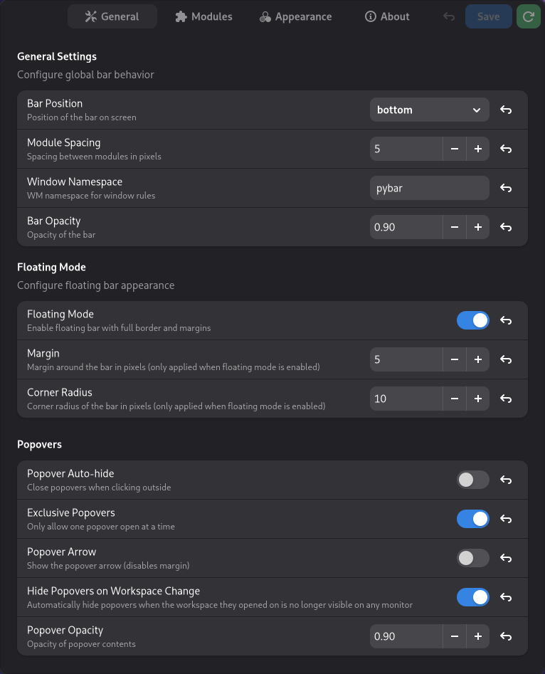

Configuration is done through the settings window that can be opened through the bar's context menu or by opening it with `pybar --settings`.


Editing the json config file directly is not recommended. The settings app was built to provide type validation for settings.


