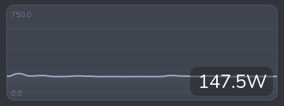
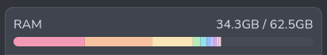

All of the following are available via the `common` package
(`import common as c`).

## Layout helpers

`c.box(orientation, spacing=0, style=None)` creates a `Gtk.Box`. Pass
`'h'` or `'v'` for orientation:

```python
row = c.box('h', spacing=10)
col = c.box('v', spacing=5, style='widget')
```

`c.sep(orientation, style=None)` creates a `Gtk.Separator`:

```python
row.append(c.sep('v'))   # vertical rule between siblings
col.append(c.sep('h'))   # horizontal rule
```

`c.label(text, style=None, ha=None, va=None, he=False, wrap=None, length=None)`
creates a `Gtk.Label`. `ha`/`va` accept `'start'`, `'end'`, `'center'`,
or `'fill'`. `he=True` makes the label expand horizontally (useful for
pushing other widgets to the right). `wrap` sets a max character width
for word-wrapping. `length` enables truncation with a hover tooltip for
the full text:

```python
# Expands to fill remaining space
title = c.label('CPU', style='heading', ha='start', he=True)

# Truncated at 20 chars with hover tooltip showing full text
cmd = c.label(long_string, length=20)
```

`c.level(min=0, max=100, value=0, style=None)` creates a `Gtk.LevelBar`:

```python
bar = c.level(min=0, max=100, value=round(percent))
bar.set_hexpand(True)
```

`c.scroll(width=0, height=0, style=None)` creates a basic
`Gtk.ScrolledWindow`. For most popover use cases the gradient scroll
boxes below are preferred.


## Graph



`c.Graph` is a Cairo drawing area that renders a scrolling line graph.

```python
graph = c.Graph(
    data=[[0]],       # list of series; each series is a list of values
    state=42,         # current value shown as an overlay label
    unit='%',         # appended to the state label
    height=180,       # widget height in pixels
    width=300,        # widget width in pixels
    smooth=False,     # Catmull-Rom smoothing (slower, better for few pts)
    min_config=0,     # fixed y-axis minimum (None = auto)
    max_config=100,   # fixed y-axis maximum (None = auto)
    colors=[(0.3, 0.6, 0.9)],  # one RGB tuple per series
)
```

Pass multiple series to overlay them on the same graph:

```python
graph = c.Graph(
    data=[history_core0, history_core1, history_core2],
    colors=self.get_colors(3),
    ...
)
```

Call `update_data` in `update_ui` to push new values without rebuilding
the widget:

```python
pw['graph'].update_data(
    [data['history']],   # same shape as the constructor's data
    round(data['total']) # new state value
)
```

Optional constructor parameters:

| Parameter | Default | Description |
|-----------|---------|-------------|
| `secondary_data` | `None` | A second data series drawn as vertical pill bars |
| `hover_labels` | `[]` | Per-point strings shown in a tooltip on hover |
| `time_markers` | `[]` | Data-point indices where a vertical dashed line is drawn |
| `time_labels` | `[]` | Labels for each time marker |
| `icon_data` | `[]` | Per-point icon strings; a FA icon is drawn at each change |
| `pin_first_to_edge` | `False` | Pin the first data point to x=0 |
| `center_in_bins` | `False` | Centre each point in an equal-width bin |

## PillBar



`c.PillBar` is a Cairo drawing area that renders a segmented, rounded
bar suitable for showing a percentage breakdown (e.g. memory by process).

```python
bar = c.PillBar(
    height=12,       # bar height in pixels
    radius=6,        # corner radius
    wrap_width=None, # max chars for hover tooltip wrapping
    hover_delay=0,   # ms delay before hover tooltip appears
)
```

Call `update` to set the segments. Each segment is a dict with
`percent`, `color`, and an optional `tooltip`:

```python
bar.update([
    {'percent': 40.0, 'color': (0.95, 0.74, 0.69), 'tooltip': 'firefox'},
    {'percent': 20.0, 'color': (0.56, 0.63, 0.75), 'tooltip': 'python3'},
    {'percent': 10.0, 'color': (1.0, 1.0, 1.0),   'tooltip': 'Other'},
])
```

`percent` values are relative to the full bar width (i.e. they should
add up to at most 100). Segments that would be less than 0.5 px wide
are skipped. Hovering over a segment shows its `tooltip` in a small
popover.

## VScrollGradientBox / HScrollGradientBox

These wrap a child widget in a `Gtk.ScrolledWindow` and overlay
edge-fade gradients to signal scrollable content. They also animate a
brief flash when the user tries to scroll past the end. This is
similar to how the built-in `ScrolledWindow` class works, but
provides a more customizable gradient.

`c.VScrollGradientBox` scrolls vertically:

```python
vsgb = c.VScrollGradientBox(
    child,               # any Gtk widget
    height=250,          # fixed viewport height in pixels (0 = unconstrained)
    max_height=None,     # soft maximum; widget expands up to this height
    width=400,           # fixed viewport width in pixels (0 = unconstrained)
    gradient_size=None,  # fade band size in pixels (default: 30)
)
c.add_style(vsgb, 'box')
```

`c.HScrollGradientBox` scrolls horizontally:

```python
hsgb = c.HScrollGradientBox(
    child,
    height=0,
    max_width=None,
    gradient_size=None,
)
```

Both classes expose `._scroll` (the inner `Gtk.ScrolledWindow`) if you
need to swap the child after construction:

```python
vsgb._scroll.set_child(new_content)
```
