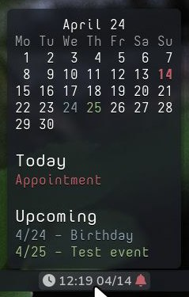
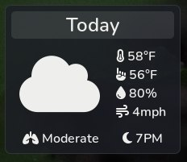

I created Pybar because I wanted to be able to display more information for modules on Waybar.

There were actually a few iterations of this concept. I originally tried making formatted monospace tooltips. This worked surprisingly well, but is ugly and a bit limiting.

Then I tried making standalone gtk windows that open when clicking on modules in specified zones. This also worked pretty well, but has the limitation of now allowing windows to spawn at the cursor position in wayland.

That led me to think "How hard could it be to just make the whole statusbar?" and the rest is (somewhat long) history.
