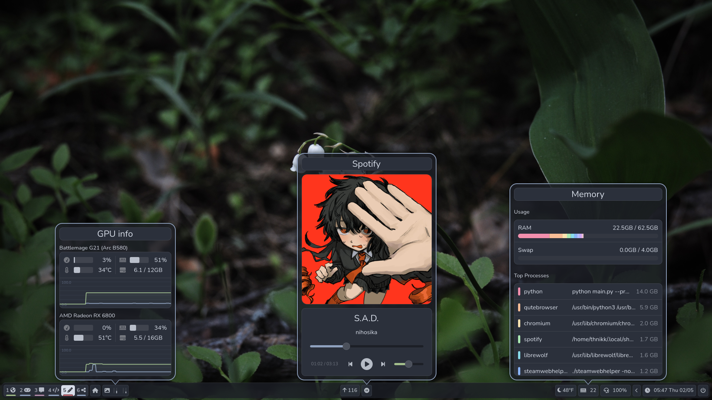

<p align="center">
    
    
</p>

<p align="center">
    A statusbar for Sway with widgets.
</p>



### Installation
Pybar is released as an executable with pyinstaller. If you're on Arch or Ubuntu, you can just download the latest release for your distribution.

[Releases](https://github.com/thnikk/pybar/releases)

### Manual Installation and Development
1. Clone the repo

``` bash
git clone https://github.com/thnikk/pybar
```

2. cd into it

``` bash
cd pybar
```

3. Create the virtual environment

``` bash
python3 -m venv .venv
```

4. Install python dependencies in the venv

``` bash
.venv/bin/pip install -r requirements.txt
```

5. Run pybar

``` bash
.venv/bin/python3 main.py
```
