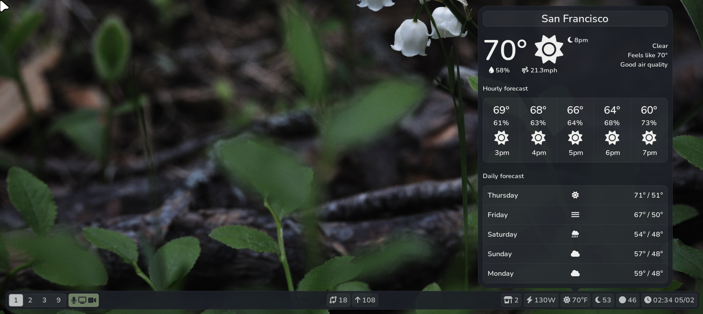

# Pybar



Pybar is a statusbar for Wayland desktops. The main goal of the project is to be compatible with modules written for waybar and to add custom widgets for modules when clicked.

### Modules with widgets
- Weather
- Updates
- Hoyoverse
- Git
- XDrip+
- Calendar
- Volume
- Backlight
- Battery
- Network
- Power
- Sales
- Generic waybar module for waybar-formatted modules

### Goals
There are still some things missing, including:
- All built-in modules should be included in this repo (they currently expect the waybar-modules repo in ~/.local/bin/bar)
- Store module output in memory instead of files. This should improve performance.
- Allow for more configuration of built-in widgets.
- Allow differently configured bars for different monitors.

### Installation
As pybar is still under very active development, I haven't looked into packaging yet. For now, you can:

Clone the repo in a safe place

```
$ mkdir ~/Git
$ cd ~/Git
$ git clone https://github.com/thnikk/pybar
```

Create a launcher called `pybar` and put it somewhere in your PATH
```
#!/usr/bin/env sh

# Kill previous instances
pkill -f "python.*pybar"

# Run new bar and log to file
python ~/Git/Python/pybar/main.py > ~/.cache/pybar.log 2>&1
```

To use the bar on sway, replace the bar section of your config with:
```
bar {
    swaybar_command pybar
}
```

To update it, you can run:
```
$ git -C ~/Git/pybar pull --rebase
```
