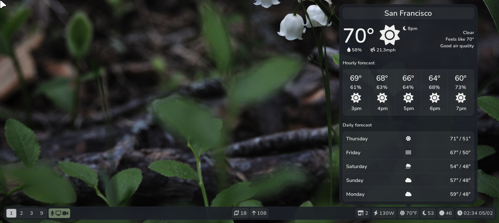

<p align="center">
    
    
</p>

<p align="center">
    A statusbar for Sway with clickable widgets.
</p>



### Modules with widgets
- Weather
- Updates
- Hoyoverse
- Git
- XDrip+
- Calendar
- Volume
- Backlight
- Battery
- Network
- Power
- Sales
- Generic waybar module for waybar-formatted modules

### Goals
There are still some things missing, including:
- [x] All built-in modules should be included in this repo (they currently expect the waybar-modules repo in ~/.local/bin/bar)
    - Figure out good packaging solution for dependencies like genshin.py
- [x] Allow for more configuration of built-in widgets and don't use additional config files for modules.
- [x] Store module output in memory instead of files. This should improve performance.
    - Some modules still cache to a file, but I don't think this is an issue for modules that update frequently.
- [x] Don't crash if there's no configuration for a module in the config file.
- [x] Reconnect to pulse server on connection loss
- [x] Fix privacy module
- [ ] Allow differently configured bars for different monitors.
- [ ] Dynamically redraw widgets
- [ ] Remove all custom styles when no module style is specified.

### Installation
As pybar is still under very active development, I haven't looked into packaging yet. For now, you can:

Clone the repo in a safe place

```
$ mkdir ~/Git
$ cd ~/Git
$ git clone https://github.com/thnikk/pybar
```

Create a launcher called `pybar` and put it somewhere in your PATH
```
#!/usr/bin/env sh

# Kill previous instances
pkill -f "python.*pybar"

# Run new bar and log to file
python -u ~/Git/pybar/main.py > ~/.cache/pybar.log 2>&1
```

To use the bar on sway, replace the bar section of your config with:
```
bar {
    swaybar_command pybar
}
```

To update it, you can run:
```
$ git -C ~/Git/pybar pull --rebase
```
