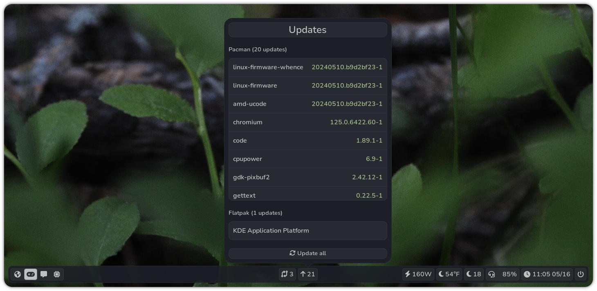

<p align="center">
    
    
</p>

<p align="center">
    A statusbar for Sway with clickable widgets.
</p>



### Modules with widgets
- Weather
- Updates
- Hoyoverse
- Git
- XDrip+
- Calendar
- Volume
- Backlight
- Battery
- Network
- Power
- Sales
- Generic waybar module for waybar-formatted modules

### Installation
As pybar is still under very active development, I haven't looked into packaging yet. For now, you can:

Clone the repo in a safe place and cd into it

```
$ mkdir ~/Git
$ cd ~/Git
$ git clone https://github.com/thnikk/pybar
$ cd pybar
```

Create a virtualenv for pybar and install dependencies
```
$ python -m venv ~/.venv/pybar
$ ~/.venv/pybar/bin/pip install -r requirements.txt
```

Create a launcher called `pybar` and put it somewhere in your $PATH 
```
#!/usr/bin/env sh

# Kill previous instances
pkill -f "python.*pybar"

# Run new bar and log to file
~/.venv/pybar/bin/python -u ~/Git/pybar/main.py > ~/.cache/pybar.log 2>&1
```

To use the bar on sway, replace the bar section of your config with:
```
bar {
    swaybar_command pybar
}
```

To update it, you can run:
```
$ git -C ~/Git/pybar pull --rebase
```
